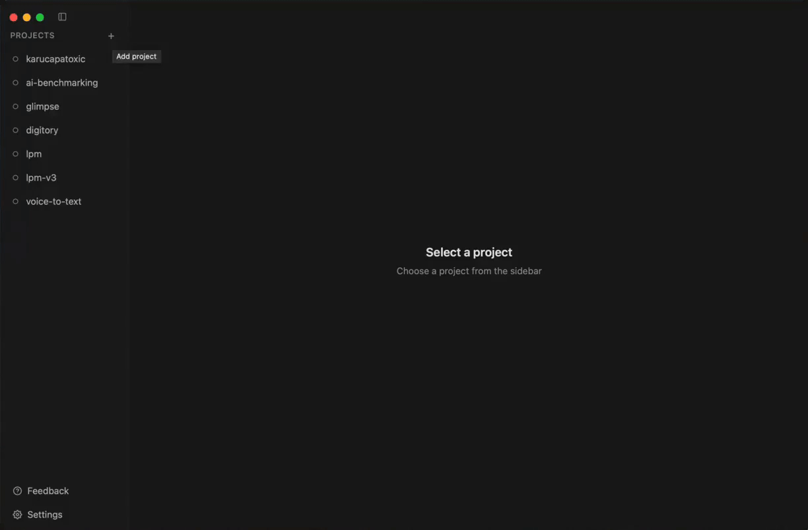
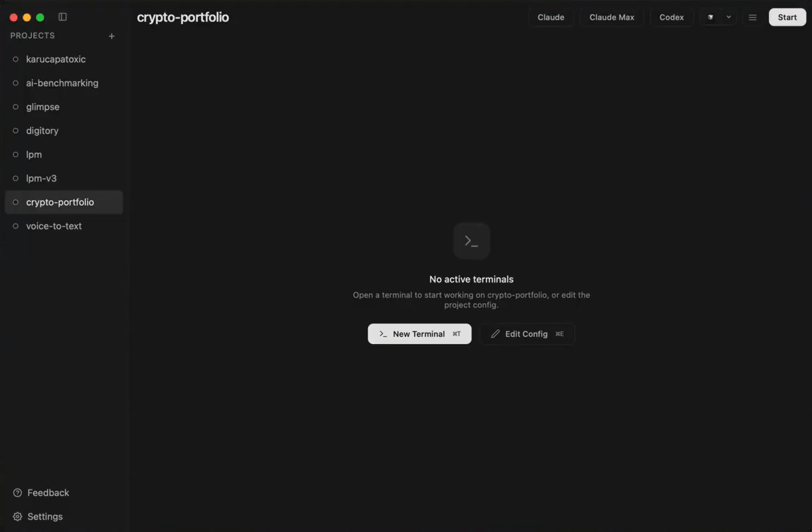
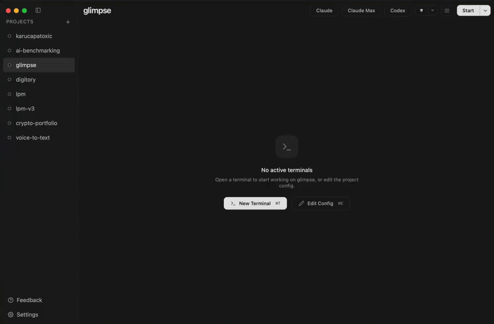
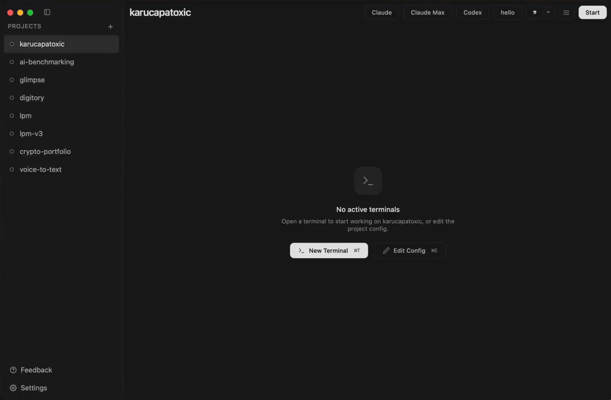
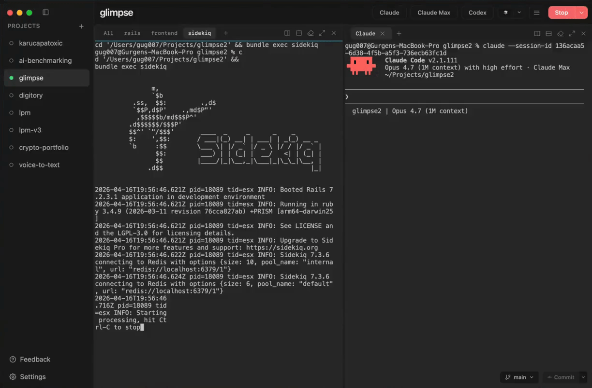
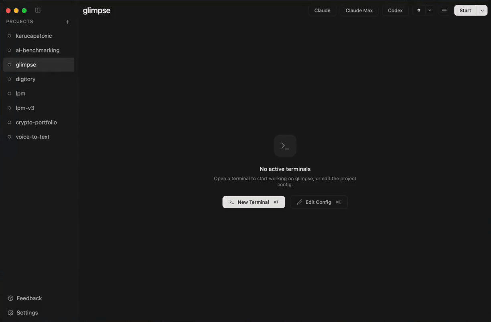

# lpm — Local Project Manager

<p align="center">
  <i>One click to start, stop, or duplicate your dev projects.
  Run Claude Code, Codex, and other AI agents in parallel on the same codebase — no conflicts, no context switching.</i>
</p>

<p align="center">
  <a href="https://lpm.cx"></a>
  <a href="https://github.com/gug007/lpm/releases/latest"></a>
</p>

---

<p align="center">
  <a href="https://lpm.cx"><strong>Download lpm for macOS</strong></a>
</p>

A native macOS desktop app for managing your dev projects. Start, stop, duplicate, and switch between projects with a single click — with a built-in terminal optimized for AI coding agents like Claude Code and Codex.

- Start and stop your entire project with a single click
- Build fast with AI coding agents
- The best terminal for AI agents like Claude Code and Codex
- Duplicate your project instantly to build features in parallel —  
  run multiple agents on the same codebase without conflicts
- A single workspace for all your services, terminals, and agents
- Switch between projects without losing context or running processes
- Keep long-running tasks alive across sessions

## Install

Download the `.dmg` from [Releases](https://github.com/gug007/lpm/releases/latest), open it, and drag lpm to Applications.

Supports macOS (Apple Silicon & Intel).

## See it in action

<p align="center">
  <strong>Add a project</strong> — browse to a directory, define services, save<br><br>
  
  <br><br>
  <strong>Start a project</strong> — one click, live terminal output for every service<br><br>
  
  <br><br>
  <strong>Run AI agents alongside your services</strong> — Claude Code, Codex, or any agent in the same workspace<br><br>
  
  <br><br>
  <strong>Duplicate a project</strong> — work on features in parallel, no conflicts<br><br>
  
  <br><br>
  <strong>Fast switching</strong> — stop one project, start another in seconds<br><br>
  
  <br><br>
  <strong>Split terminals</strong> — arrange services and agents side-by-side<br><br>
  
</p>

## Why lpm?

- **Native macOS app** — GUI with live terminal, config editor, notes, and theme support
- **No Docker required** — runs your services natively
- **Auto-detects project setup** — Rails, Next.js, Go, Django, Flask, Docker Compose
- **Profiles** for running service subsets
- **Actions** — one-shot commands like tests, migrations, and deploys, runnable from the Actions button
- **Works with any stack** — if it runs in a terminal, lpm can manage it
- **CLI + App in sync** — same features, same state, mix and match freely

## AI Agent Skill

lpm includes an agent skill that lets your AI coding agent create and manage lpm configs for you. Install it via [skills.sh](https://skills.sh):

```bash
npx skills add gug007/lpm
```

Then just tell your agent "set up lpm for this project" and it will analyze your codebase, discover services, and write the config.

See [lpm-config/README.md](lpm-config/README.md) for details.

## CLI

Prefer the terminal? lpm also ships with a CLI that shares the same config and state as the desktop app.

See [README-CLI.md](README-CLI.md) for install instructions, commands, and configuration reference.
