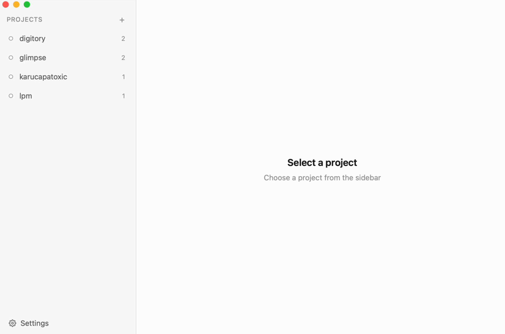

# lpm — Local Project Manager

<p align="center">
  <i>Start, stop, and switch between local dev projects with a single command. CLI and native macOS desktop app.</i>
</p>

<p align="center">
  <a href="https://lpm.cx"></a>
  <a href="https://github.com/gug007/lpm/releases/latest"></a>
 
</p>

---

<p align="center">
  <strong>Add a project</strong> — browse to a directory, define services, save<br><br>
  
  <br><br>
  <strong>Start a project</strong> — one click, live terminal output for every service<br><br>
  
  <br><br>
  <a href="https://lpm.cx">Download lpm for macOS</a><br>
</p>

A lightweight local project manager for macOS. Define your project services in a simple YAML config, then start, stop, and switch between dev projects with a single command. Built for developers who juggle multiple services — Rails, Next.js, Go, Django, Docker Compose, and more.

**Two ways to use it — CLI and desktop app.** Both have the same functionality, share the same config and state, and stay fully in sync. Start a project from the app, stop it from the terminal. Use whichever fits your workflow, or both.

**Why lpm?**

- No Docker required — runs your services natively
- Auto-detects project setup (Rails, Next.js, Go, Django, Flask, Docker Compose)
- One command to switch between projects
- Profile support for running service subsets
- Tab completion for all commands
- **Desktop app** — native macOS GUI with live terminal, config editor, and theme support
- **CLI + App in sync** — same features, same state, mix and match freely
- Works with any stack — if it runs in a terminal, lpm can manage it

## Install lpm

**CLI:**

```sh
curl -fsSL https://raw.githubusercontent.com/gug007/lpm/main/install.sh | bash
```

**Desktop app:** download the `.dmg` from [Releases](https://github.com/gug007/lpm/releases/latest), open it, and drag to Applications.

Supports macOS (Apple Silicon & Intel).

## Quick start

```sh
cd ~/Projects/myapp
lpm init          # detects services, creates config
lpm myapp         # start in background, show status
lpm start myapp   # start and open terminal to session
lpm switch other  # stop myapp, start other
lpm kill          # stop everything
```

`lpm init` auto-detects Rails, Node.js, Next.js, Vite, React, Go, Django, Flask, and Docker Compose projects.

## Examples

**Simple — Next.js app**

```yaml
# ~/.lpm/projects/storefront.yml
name: storefront
root: ~/Projects/storefront
services:
  dev: npm run dev
```

```sh
lpm storefront         # start in background
lpm start storefront   # start and open terminal
lpm kill storefront    # stop
```

**Full stack — Python API + Next.js frontend + worker**

```yaml
# ~/.lpm/projects/myapp.yml
name: myapp
root: ~/Projects/myapp

services:
  api:
    cmd: python manage.py runserver
    cwd: ./backend
    port: 8000
  frontend:
    cmd: npm run dev
    cwd: ./frontend
  worker: celery -A backend worker

profiles:
  default: [api, frontend]
  full: [api, frontend, worker]

actions:
  test: pytest
  migrate:
    cmd: python manage.py migrate
    cwd: ./backend
    confirm: true
  deploy: ./scripts/deploy.sh
```

Services can be a simple string (`dev: npm run dev`) or a full object when you need `cwd`, `port`, or `env`. Actions are one-shot commands — test runners, migrations, deploy scripts.

`confirm: true` shows a confirmation dialog before running. Actions can be run from the CLI or from the desktop app via the Actions button.

```sh
lpm myapp              # starts api + frontend
lpm myapp -p full      # starts everything
lpm run myapp test     # run tests
lpm run myapp deploy   # deploy
```

## CLI Commands

| Command                      | Description                          |
| ---------------------------- | ------------------------------------ |
| `lpm <project>`              | Start in background                  |
| `lpm start <project>`        | Start and open terminal              |
| `lpm switch <project>`       | Stop all, start another              |
| `lpm kill [project]`         | Stop a project (all if none given)   |
| `lpm list`                   | List all projects                    |
| `lpm status <project>`       | Show project details                 |
| `lpm init [name]`            | Create config from current directory |
| `lpm edit <project>`         | Open config in `$EDITOR`             |
| `lpm remove <project>`       | Remove a project                     |
| `lpm open <project>`         | View a running project's live output |
| `lpm run <project> <action>` | Run a project action                 |

## Project Configuration

Configs live in `~/.lpm/projects/<name>.yml`. Each config has:

- **root** — project directory
- **services** — named services with `cmd`, `cwd`, `port`, and `env`
- **profiles** — groups of services to start together

Configs are validated on load — lpm will catch missing commands, invalid ports, duplicate ports, and nonexistent directories before starting anything.
