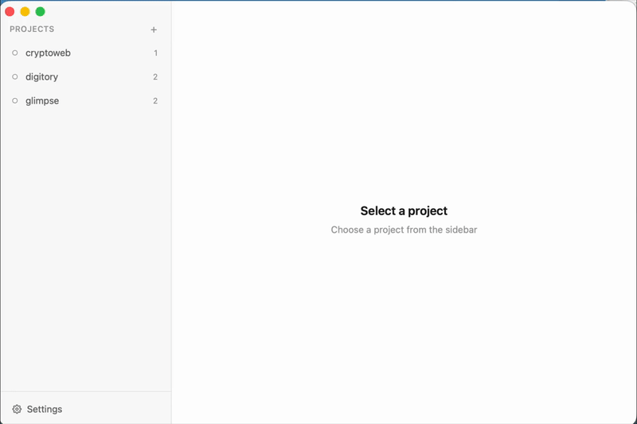

<p align="center">
  <b>lpm</b> — local project manager
  <br>
  <i>Start, stop, and switch between local dev projects with a single command.</i>
</p>

<p align="center">
  <a href="https://gug007.github.io/lpm/"></a>
  <a href="https://github.com/gug007/lpm/releases/latest"></a>
 
</p>

---

<p align="center">
  
  <br>
  <a href="https://gug007.github.io/lpm/">Download the app</a>
</p>

A CLI tool for managing local development environments. Define your project services in a simple YAML config, then start, stop, and switch between projects instantly. Built for developers who work on multiple projects and need fast context switching.

**Why lpm?**

- No Docker required — runs your services natively
- Auto-detects project setup (Rails, Next.js, Go, Django, Flask, Docker Compose)
- One command to switch between projects
- Profile support for running service subsets
- Tab completion for all commands
- **Desktop app** — native macOS GUI with live terminal, config editor, and theme support
- Works with any stack — if it runs in a terminal, lpm can manage it

## Install

**CLI:**

```sh
curl -fsSL https://raw.githubusercontent.com/gug007/lpm/main/install.sh | bash
```

**Desktop app:** download the `.dmg` from [Releases](https://github.com/gug007/lpm/releases/latest), open it, and drag to Applications.

Supports macOS (Apple Silicon & Intel) and Linux (amd64 & arm64).

## Quick start

```sh
cd ~/Projects/myapp
lpm init          # detects services, creates config
lpm myapp         # start in background, show status
lpm start myapp   # start and open terminal to session
lpm switch other  # stop myapp, start other
lpm kill          # stop everything
```

`lpm init` auto-detects Rails, Node.js, Next.js, Vite, React, Go, Django, Flask, and Docker Compose projects.

## Examples

**Simple — Next.js app**

```yaml
# ~/.lpm/projects/storefront.yml
name: storefront
root: ~/Projects/storefront
services:
  dev: npm run dev
```

```sh
lpm storefront         # start in background
lpm start storefront   # start and open terminal
lpm kill storefront    # stop
```

**Full stack — Rails API + React frontend + background workers**

```yaml
# ~/.lpm/projects/myapp.yml
name: myapp
root: ~/Projects/myapp
services:
  api:
    cmd: rails s -p 3000
    cwd: ./backend
    port: 3000
    env:
      RAILS_ENV: development
  frontend: npm run dev
  sidekiq: bundle exec sidekiq
profiles:
  default: [api, frontend]
  full: [api, frontend, sidekiq]
```

Services can be a simple string (`dev: npm run dev`) or a full object when you need `cwd`, `port`, or `env`.

```sh
lpm myapp            # starts api + frontend in background
lpm start myapp      # start and open terminal
lpm myapp -p full    # starts everything
```

## Commands

| Command                | Description                          |
| ---------------------- | ------------------------------------ |
| `lpm <project>`        | Start in background                  |
| `lpm start <project>`  | Start and open terminal              |
| `lpm switch <project>` | Stop all, start another              |
| `lpm kill [project]`   | Stop a project (all if none given)   |
| `lpm list`             | List all projects                    |
| `lpm status <project>` | Show project details                 |
| `lpm init [name]`      | Create config from current directory |
| `lpm edit <project>`   | Open config in `$EDITOR`             |
| `lpm remove <project>` | Remove a project                     |
| `lpm open <project>`   | Open project in Finder               |

## Configuration

Configs live in `~/.lpm/projects/<name>.yml`. Each config has:

- **root** — project directory
- **services** — named services with `cmd`, `cwd`, `port`, and `env`
- **profiles** — groups of services to start together

Configs are validated on load — lpm will catch missing commands, invalid ports, duplicate ports, and nonexistent directories before starting anything.

## License

MIT
